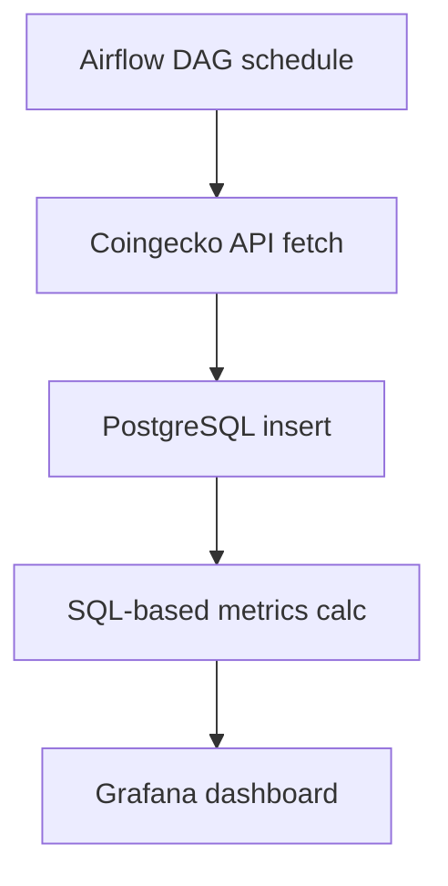

# 변동성 기반 암호화폐 마케팅 인사이트 대시보드

## 개요

본 프로젝트는 암호화폐 가격의 **변동성(volatility)**과 **거래량(volume)**을 기반으로,  
마케팅 및 운영 전략에 실질적으로 활용 가능한 인사이트를 제공하는 **실시간 대시보드**를 구축하는 데 목적이 있습니다.

PostgreSQL 기반의 시계열 데이터를 분석하고, Grafana를 활용해 시각화하였으며,  
Airflow를 통해 데이터 수집 파이프라인도 자동화하였습니다.

---

## 🛠 사용 기술 스택

- **데이터 수집**: Coingecko API  
- **ETL 스케줄링**: Apache Airflow (Docker 기반 구성)  
- **DB**: PostgreSQL  
- **시각화 도구**: Grafana  
- **데이터 테이블**: `dashboard`

---

## 📦 수집 데이터 항목 (1시간 단위 시계열)

- `timestamp`: 수집 시점  
- `coin_id`: 코인명  
- `price_open`, `price_high`, `price_low`, `price_close`: 시가, 고가, 저가, 종가  
- `volume`: 거래량  
- `market_cap`: 시가총액

---

## 🔁 데이터 수집 자동화 (Airflow DAG)

### 🧩 DAG 명: `daily_coin_ingest_dag`

- **목적**: 매일 특정 시간에 Coingecko API를 통해 암호화폐 시세 데이터를 수집하고, PostgreSQL DB에 저장
- **스케줄**: 매일 오전 9시 (UTC 기준) 실행

---

### 🛠 DAG 구성

```python
from airflow import DAG
from airflow.operators.python import PythonOperator
from datetime import datetime, timedelta
import requests, psycopg2

def fetch_coin_data(coin_id):
    # 1. OHLC 데이터 요청
    ohlc_url = f"https://api.coingecko.com/api/v3/coins/{coin_id}/ohlc?vs_currency=usd&days=1"
    ohlc_data = requests.get(ohlc_url).json()

    # 2. Market chart 데이터 요청 (거래량, 시가총액)
    chart_url = f"https://api.coingecko.com/api/v3/coins/{coin_id}/market_chart?vs_currency=usd&days=1"
    chart_data = requests.get(chart_url).json()

    # 3. PostgreSQL에 저장
    conn = psycopg2.connect(
        host="host.docker.internal",
        database="vip",
        user="postgres",
        password="your_password"
    )
    cur = conn.cursor()
    for idx, row in enumerate(ohlc_data):
        timestamp = datetime.utcfromtimestamp(row[0] / 1000)
        price_open, price_high, price_low, price_close = row[1:5]

        volume = chart_data["total_volumes"][idx][1]
        market_cap = chart_data["market_caps"][idx][1]

        cur.execute("""
            INSERT INTO dashboard (coin_id, timestamp, price_open, price_high, price_low, price_close, volume, market_cap)
            VALUES (%s, %s, %s, %s, %s, %s, %s, %s)
            ON CONFLICT DO NOTHING;
        """, (coin_id, timestamp, price_open, price_high, price_low, price_close, volume, market_cap))

    conn.commit()
    cur.close()
    conn.close()
```

---


## 🔄 데이터 파이프라인 구성 흐름





전체 흐름 설명
Airflow DAG를 통해 매일 오전 정해진 시간에 자동 실행

Coingecko API로 주요 코인들의 시세/거래량/시가총액 수집

수집된 데이터를 PostgreSQL의 dashboard 테이블에 저장

SQL 쿼리를 통해 시계열 분석 및 변동성 지표 생성

Grafana 대시보드에서 실시간 KPI/인사이트 시각화

자동화된 시계열 수집 → 분석 → 시각화 파이프라인이 구현되어 있습니다. 


## 대시보드 구성

### 1️⃣ 변동성 구간별 거래량 분포
- **목적**: 가격 변동이 클수록 고객들이 더 많이 거래하는지 확인
- **시각화**: 변동률 구간(0~1%, 1~3%, 3~5% 이상)별 평균 거래량 히트맵


#### 가격 변동성과 거래량 분석 인사이트

1. 분석 목적
가격 변동성(%)이 거래량에 미치는 영향을 파악하여,  
고객 반응이 민감한 시점을 식별하고 **마케팅 대응 타이밍**을 도출하기 위함.


2. 주요 인사이트
  - 비트코인 (BTC)
    - 변동률이 높아질수록 **거래량 증가 경향**이 명확하게 나타남.
    - **변동성 3~5% 구간**에서 가장 높은 평균 거래량 기록.
      - → 시장 반응성이 큰 대표 코인.
      - → **단기 푸시 알림**이나 **이벤트 대상**으로 유력.

  - 이더리움 (ETH)
    - 전 구간에서 **꾸준한 거래량**을 유지.
    - **5% 이상 고변동 구간**에서도 거래가 활발함.
      - → **고변동 이벤트에 안정적으로 반응**.
      - → **마케팅 실험군**으로 적합.

  - 솔라나, 리플 등
    - **낮은 변동 구간**에서도 거래가 고르게 발생.
    - 다만, **고변동 시점(5% 이상)**에서 **거래량 급증** 경향.
      - → **모멘텀 대응형 코인**으로 분류 가능.

3. 유의사항
  - 일부 코인(BTC 등)은 특정 변동성 구간(예: **5% 이상**)에 **데이터 미존재** 가능.
  - 따라서 `"변동성↑ → 거래량↓"` 해석은 **데이터 누락 가능성**을 고려하여  
    보류하거나 **제한적으로 해석**해야 함.


4. 활용 예시
  - **변동성 기준 세그먼트별 푸시 발송 전략 수립**
  - **고변동성 반응 코인 중심의 캠페인 대상 선정**
  - **일별/시간대별 푸시 스케줄링 최적화** 지표로 활용

---

### 2️⃣ 변동성 반응 사례 Top 5
- **목적**: 변동성이 클 때 실제 거래가 크게 반응한 코인 확인
- **시각화**: 변동률 상위 5개 시점 + 해당 거래량 테이블
- **활용**: 이벤트 타겟 선정 및 트렌드 이슈 분석


---

### 3️⃣ 변동성 급등 알림 리스트
- **목적**: 최근 급격한 시장 변화 감지
- **기준**: 1시간 내 변동률 10% 이상 발생한 코인 목록
- **시각화**: 리스트 형태로 실시간 확인 가능
- **활용**: 공지/운영 대응, 이상 트래픽 판단


---

### 4️⃣ 고객 행동 예측용 KPI 요약
**Stat Panel 형태의 핵심 지표 요약**

- ✅ 가장 거래량이 많은 코인
- ✅ 거래량 급증률 1위 코인
- ✅ 최근 변동성 가장 큰 시간대
- ✅ 변동성과 거래량이 동시에 높은 푸시 추천 시간대


---

## 🔍 주요 특징

- 변동성과 거래량을 결합한 **실무형 마케팅 인사이트 대시보드**
- 이상 탐지 기반 알림 + 전략적 KPI 시각화
- Airflow 기반 자동화 수집 → PostgreSQL 분석 → Grafana 실시간 시각화

